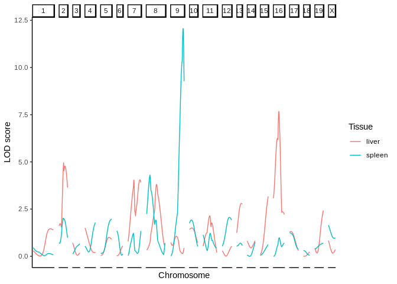
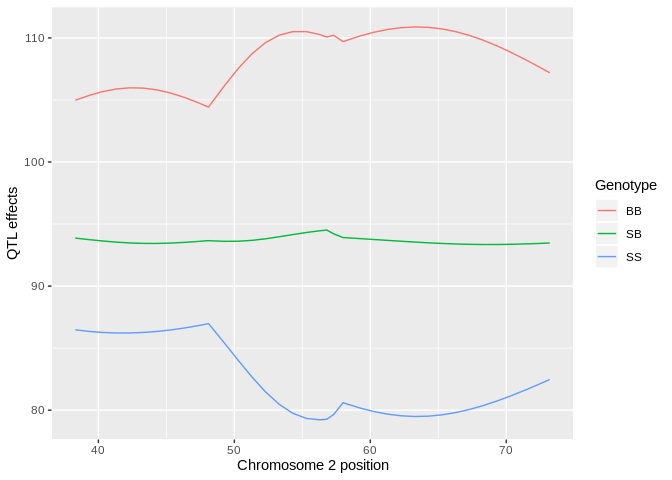
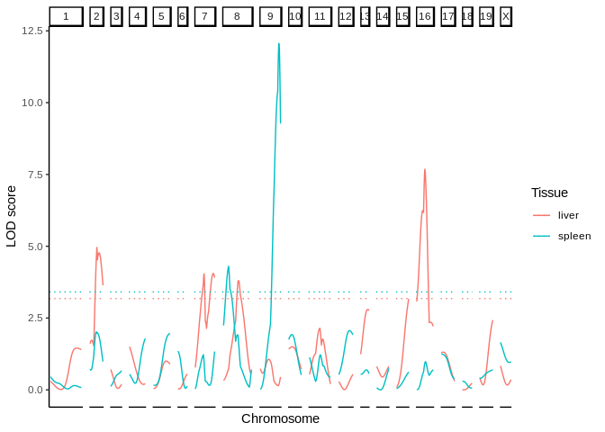

:warning: this package is under development - use with care

`R/qtl2helper`
==============

`qtl2helper` provides with some helper functions to work with objects
created by several functions in the
[`R/qtl2`](https://kbroman.org/qtl2/) package.

To install the package do:

    # make sure the remotes package is installed
    remotes::install_github("tavareshugo/qtl2helper")

Quick overview
--------------

Let's start with an example dataset from the [`qtl2` user
guide](https://kbroman.org/qtl2/assets/vignettes/user_guide.html):

    library(qtl2)
    library(qtl2helper)

    # read example data
    iron <- read_cross2( system.file("extdata", "iron.zip", package="qtl2") )
    map <- insert_pseudomarkers(iron$gmap, step=1)
    pr <- calc_genoprob(iron, map, error_prob=0.002)
    Xcovar <- get_x_covar(iron)

    # run QTL scan
    out <- scan1(pr, iron$pheno, Xcovar=Xcovar)

    # get QTL effects
    c2eff <- scan1coef(pr[,"2"], iron$pheno[,"liver"])

`qtl2helper` provides methods for the `tidy` function (from the
[`broom`]() package), which convert several `R/qtl2` objects to (long)
data frames.

    # convert scan1 object to a tibble
    tidy(out)

    ## # A tibble: 1,762 x 3
    ##    marker   pheno   LOD
    ##    <chr>    <chr> <dbl>
    ##  1 D1Mit18  liver 0.293
    ##  2 c1.loc28 liver 0.282
    ##  3 c1.loc29 liver 0.270
    ##  4 c1.loc30 liver 0.257
    ##  5 c1.loc31 liver 0.244
    ##  6 c1.loc32 liver 0.231
    ##  7 c1.loc33 liver 0.218
    ##  8 c1.loc34 liver 0.204
    ##  9 c1.loc35 liver 0.190
    ## 10 c1.loc36 liver 0.176
    ## # … with 1,752 more rows

You can provide a *map* of markers to `tidy()` to get marker positions
in the output:

    # convert scan1 object to a tibble
    tidy(out, map)

    ## # A tibble: 1,762 x 5
    ##    marker   chrom   pos pheno   LOD
    ##    <chr>    <fct> <dbl> <chr> <dbl>
    ##  1 D1Mit18  1      27.3 liver 0.293
    ##  2 c1.loc28 1      28.3 liver 0.282
    ##  3 c1.loc29 1      29.3 liver 0.270
    ##  4 c1.loc30 1      30.3 liver 0.257
    ##  5 c1.loc31 1      31.3 liver 0.244
    ##  6 c1.loc32 1      32.3 liver 0.231
    ##  7 c1.loc33 1      33.3 liver 0.218
    ##  8 c1.loc34 1      34.3 liver 0.204
    ##  9 c1.loc35 1      35.3 liver 0.190
    ## 10 c1.loc36 1      36.3 liver 0.176
    ## # … with 1,752 more rows

This makes it ideal to do further plotting, for example with `ggplot2`:

    library(ggplot2)

    out_tbl <- tidy(out, map)

    ggplot(out_tbl, aes(x = pos, y = LOD, colour = pheno)) +
      geom_line() +
      facet_grid(. ~ chrom, scales = "free_x", space = "free_x") +
      theme_classic() +
      theme(axis.text.x = element_blank(), axis.ticks.x = element_blank()) +
      labs(x = "Chromosome", y = "LOD score", colour = "Tissue")

Here's the same idea applied to the estimated QTL effects:

    # tidy the scan1coef object
    c2eff_tbl <- tidy(c2eff, map)

    # plot
    ggplot(c2eff_tbl, aes(x = pos, y = estimate, colour = coef)) +
      geom_line() +
      labs(x = "Chromosome 2 position", y = "QTL effects", colour = "Genotype")

Finally, here's an example of tidying permutations to obtain a tibble of
thresholds:

    # run permutation scans
    operm <- scan1perm(pr, iron$pheno, Xcovar=Xcovar, n_perm=10)

    # tidy output
    operm_tbl <- tidy(operm)
    operm_tbl

    ## # A tibble: 2 x 3
    ##   alpha pheno  threshold
    ##   <chr> <chr>      <dbl>
    ## 1 0.05  liver       3.18
    ## 2 0.05  spleen      3.41

These can now be added to the scan plot, for example using
`geom_hline()`:

    ggplot(out_tbl, aes(x = pos, y = LOD, colour = pheno)) +
      geom_line() +
      geom_hline(data = operm_tbl, 
                 aes(yintercept = threshold, colour = pheno), 
                 linetype = "dotted") +
      facet_grid(. ~ chrom, scales = "free_x", space = "free_x") +
      theme_classic() +
      theme(axis.text.x = element_blank(), axis.ticks.x = element_blank()) +
      labs(x = "Chromosome", y = "LOD score", colour = "Tissue")

